# Convolution

Convolution provides us the means to test an input to see if a feature is
present. We use a *kernel* to represent a feature. Sliding the kernel across the
image and comparing it to each position produces a similarity score at every
location, giving us a *feature map*. That feature map is then summarized, *pooled*,
to get a single quantification of how strongly that feature is present in the
input. The different pooling methods correspond to different interpretations of
feature presence.

## Kernels, Feature Maps, Pooling

Suppose we want to know if an image has an X or an O.
| X | O |
|-|-|
| 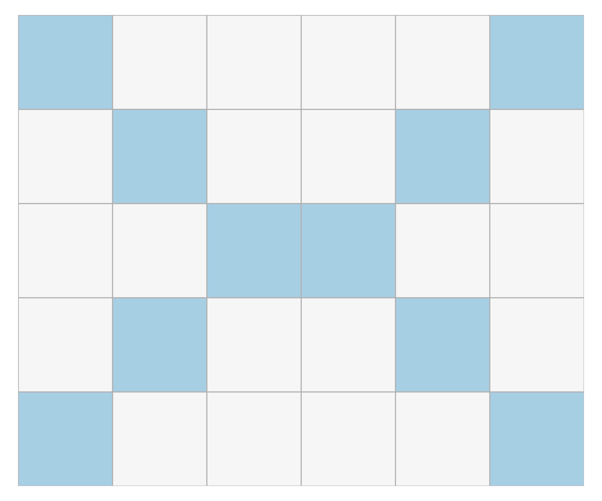 |  |

What distinguishes an X from an O?

The values in a kernel correspond to a pattern. The kernel is essentially a
small template of the feature it's looking for. We can construct a few example
kernels by hand and see how well each one picks up on that feature in our input
images.

An X has diagonal lines

| Input | Kernel | Feature Map | Max Pooling | Mean Pooling |
|-|-|-|-|-|
|  | 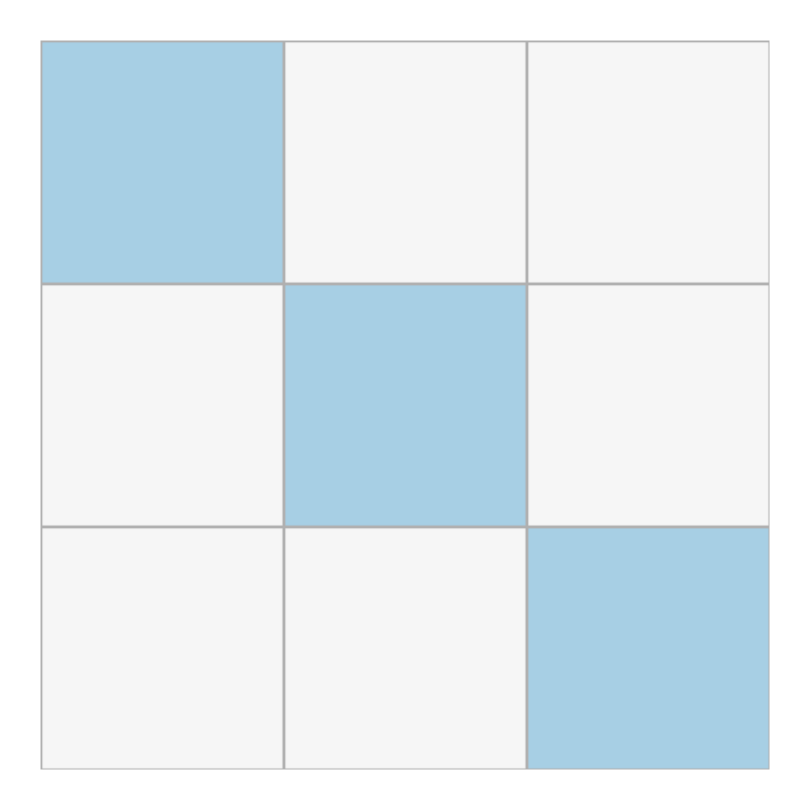 | 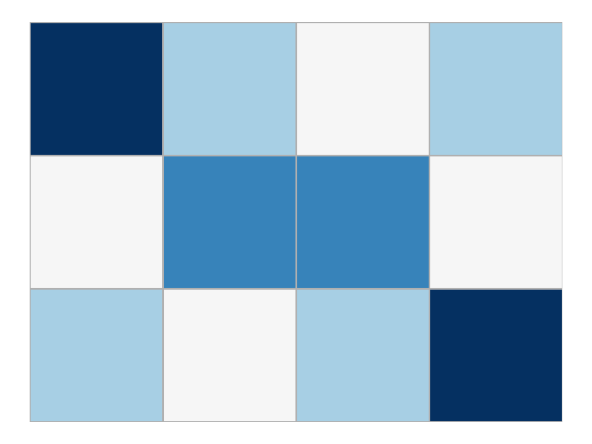 | 3.0 | 1.67 |
|  | 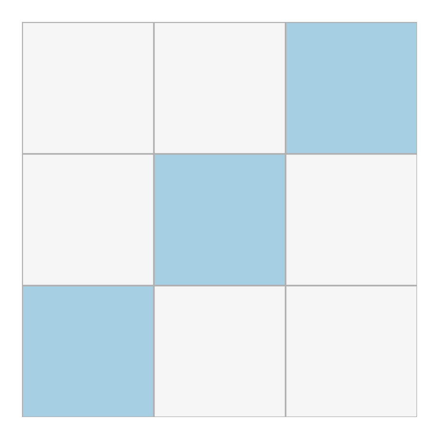 | 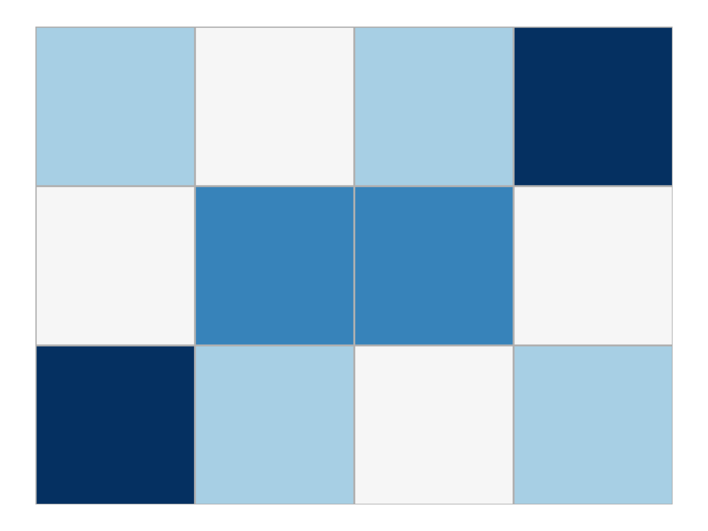 | 3.0 | 1.67 |

<details>

```
python src/img_conv.py \
    -i data/xo/inputs/x.txt \
    -k data/xo/kernels/kernel_back_diagonal.txt \
    -o out/xo/x.kernel_back_diagonal.txt
Scores:
  Max pooling  : 3.000000
  Mean pooling : 1.166667

After sigmoid (probability of X):
  Max pooling  : 0.952574
  Mean pooling : 0.762542

python src/make_img.py \
    -i out/xo/x.kernel_back_diagonal.txt \
    -o img/xo/x.kernel_back_diagonal.png

python src/img_conv.py \
    -i data/xo/inputs/x.txt \
    -k data/xo/kernels/kernel_fwd_diagonal.txt \
    -o out/xo/x.kernel_fwd_diagonal.txt
Scores:
  Max pooling  : 3.000000
  Mean pooling : 1.166667

After sigmoid (probability of X):
  Max pooling  : 0.952574
  Mean pooling : 0.762542

python src/make_img.py \
    -i out/xo/x.kernel_fwd_diagonal.txt \
    -o img/xo/x.kernel_fwd_diagonal.png
```

</details>


An O does not have diagonal lines

| Input | Kernel | Feature Map | Max Pooling | Mean Pooling |
|-|-|-|-|-|
|  |  | 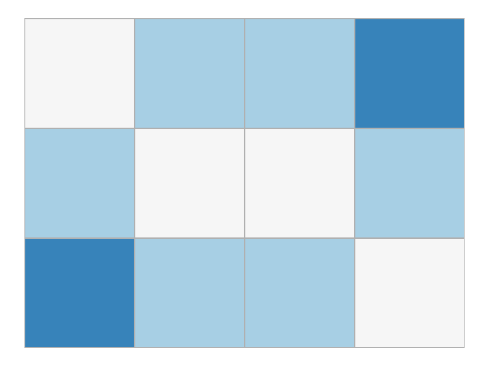 | 2.0 | 0.83 |
|  |  | 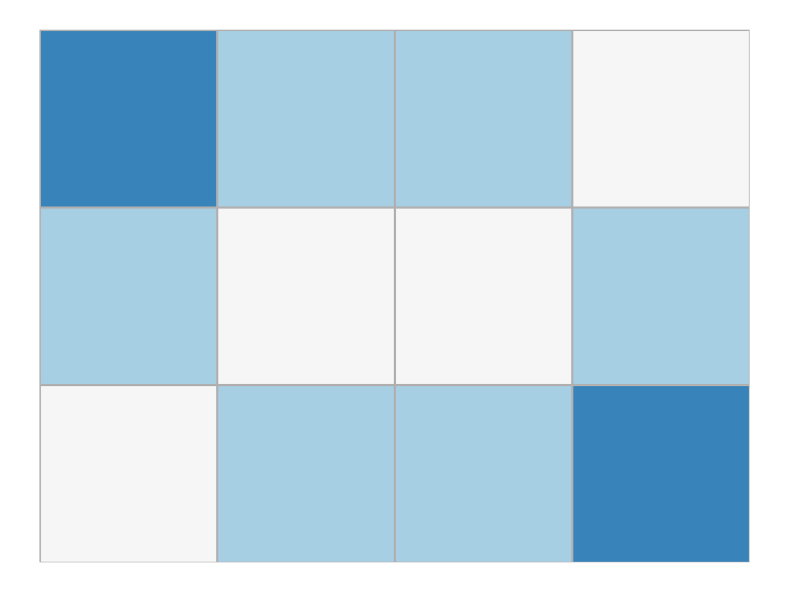 | 2.0 | 0.83 |

<details>

```
python src/img_conv.py \
    -i data/xo/inputs/o.txt \
    -k data/xo/kernels/kernel_back_diagonal.txt \
    -o out/xo/o.kernel_back_diagonal.txt
Scores:
  Max pooling  : 2.000000
  Mean pooling : 0.833333

After sigmoid (probability of X):
  Max pooling  : 0.880797
  Mean pooling : 0.697059

python src/make_img.py \
    -i out/xo/o.kernel_back_diagonal.txt \
    -o img/xo/o.kernel_back_diagonal.png

python src/img_conv.py \
    -i data/xo/inputs/o.txt \
    -k data/xo/kernels/kernel_fwd_diagonal.txt \
    -o out/xo/o.kernel_fwd_diagonal.txt
Scores:
  Max pooling  : 2.000000
  Mean pooling : 0.833333

After sigmoid (probability of X):
  Max pooling  : 0.880797
  Mean pooling : 0.697059

python src/make_img.py \
    -i out/xo/o.kernel_fwd_diagonal.txt \
    -o img/xo/o.kernel_fwd_diagonal.png
```

</details>

An O has curves.

| Input | Kernel | Feature Map | Max Pooling | Mean Pooling |
|-|-|-|-|-|
|  | 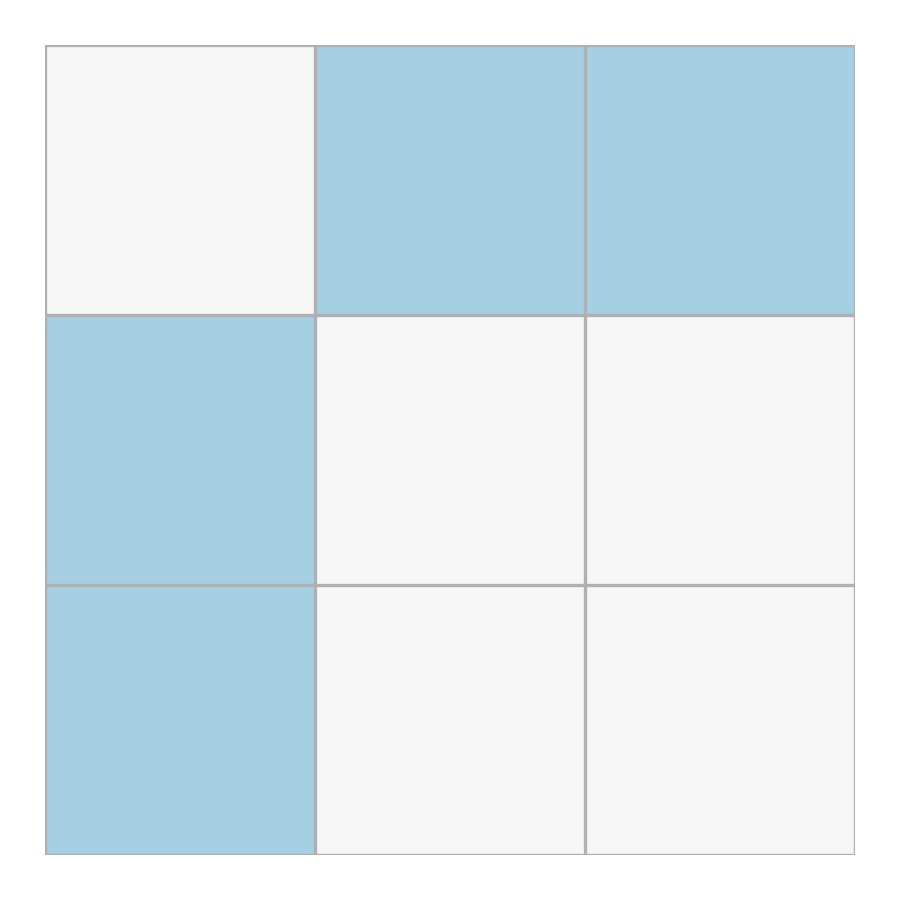 | 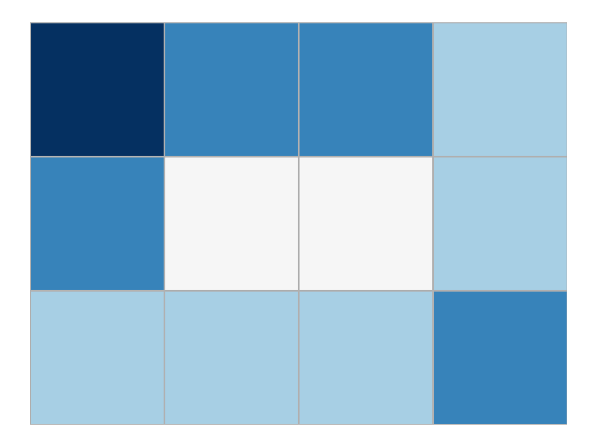 | 4.0 | 1.4 |
|  | 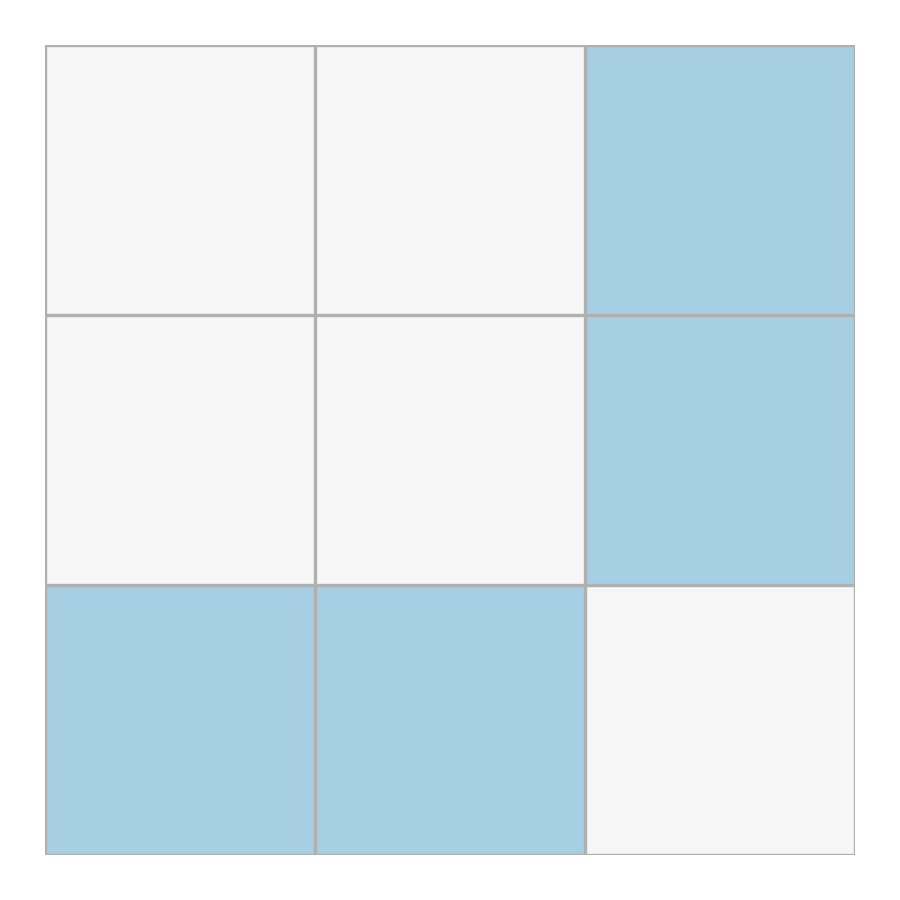 | 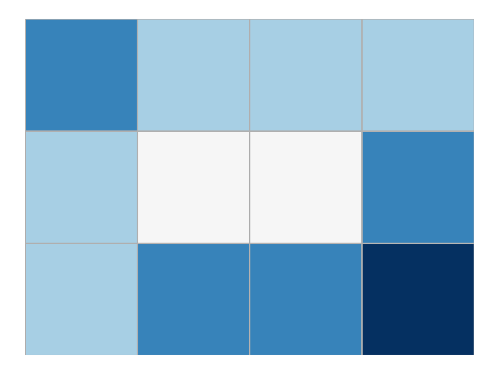 | 4.0 | 1.4 |

<details>

```
python src/img_conv.py \
    -i data/xo/inputs/o.txt \
    -k data/xo/kernels/kernel_topl_curve.txt \
    -o out/xo/o.kernel_topl_curve.txt
Scores:
  Max pooling  : 4.000000
  Mean pooling : 1.416667

After sigmoid (probability of X):
  Max pooling  : 0.982014
  Mean pooling : 0.804815

python src/make_img.py \
    -i out/xo/o.kernel_topl_curve.txt \
    -o img/xo/o.kernel_topl_curve.png

python src/img_conv.py \
    -i data/xo/inputs/o.txt \
    -k data/xo/kernels/kernel_botr_curve.txt \
    -o out/xo/o.kernel_botr_curve.txt
Scores:
  Max pooling  : 4.000000
  Mean pooling : 1.416667

After sigmoid (probability of X):
  Max pooling  : 0.982014
  Mean pooling : 0.804815

python src/make_img.py \
    -i out/xo/o.kernel_botr_curve.txt \
    -o img/xo/o.kernel_botr_curve.png
```

</details>

An X does not have curves.

| Input | Kernel | Feature Map | Max Pooling | Mean Pooling |
|-|-|-|-|-|
|  |  |  | 3.0 | 1.3 |
|  |  |  | 3.0 | 1.3 |

<details>

```
python src/img_conv.py \
    -i data/xo/inputs/x.txt \
    -k data/xo/kernels/kernel_topl_curve.txt \
    -o out/xo/x.kernel_topl_curve.txt
Scores:
  Max pooling  : 3.000000
  Mean pooling : 1.333333

After sigmoid (probability of X):
  Max pooling  : 0.952574
  Mean pooling : 0.791391

python src/make_img.py \
    -i out/xo/x.kernel_topl_curve.txt \
    -o img/xo/x.kernel_topl_curve.png

python src/img_conv.py \
    -i data/xo/inputs/x.txt \
    -k data/xo/kernels/kernel_botr_curve.txt \
    -o out/xo/x.kernel_botr_curve.txt
Scores:
  Max pooling  : 3.000000
  Mean pooling : 1.333333

After sigmoid (probability of X):
  Max pooling  : 0.952574
  Mean pooling : 0.791391

python src/make_img.py \
    -i out/xo/x.kernel_botr_curve.txt \
    -o img/xo/x.kernel_botr_curve.png
```

</details>

X has a set pixel in the corner?

| Input | Kernel | Feature Map | Max Pooling | Mean Pooling |
|-|-|-|-|-|
|  |  |  | 1.0 | 0.33 |
|  |  |  | 1.0 | 0.4 |

<details>

```
python src/img_conv.py \
    -i data/xo/inputs/x.txt \
    -k data/xo/kernels/kernel_set_corner.txt \
    -o out/xo/x.kernel_set_corner.txt
Scores:
  Max pooling  : 1.000000
  Mean pooling : 0.333333

After sigmoid (probability of X):
  Max pooling  : 0.731059
  Mean pooling : 0.582570

python src/make_img.py \
    -i out/xo/x.kernel_set_corner.txt \
    -o img/xo/x.kernel_set_corner.png

python src/img_conv.py \
    -i data/xo/inputs/o.txt \
    -k data/xo/kernels/kernel_set_corner.txt \
    -o out/xo/o.kernel_set_corner.txt
Scores:
  Max pooling  : 1.000000
  Mean pooling : 0.416667

After sigmoid (probability of X):
  Max pooling  : 0.731059
  Mean pooling : 0.602685

python src/make_img.py \
    -i out/xo/o.kernel_set_corner.txt \
    -o img/xo/o.kernel_set_corner.png
```

</details>

## Training

Real inputs have subtle and complex features nd guessing good kernel values by
hand doesn't scale. Instead of designing kernels, we can learn them directly
from examples.

### Generate training set
#### Data Augmentation
Since we do not have a dataset of Xs and Os, we can use data augmentation to
create a training set.  We can take in our X and O and move them around.
|Seed Image| Variants |
|-|-|
|  | 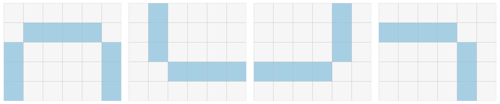 |
|  | 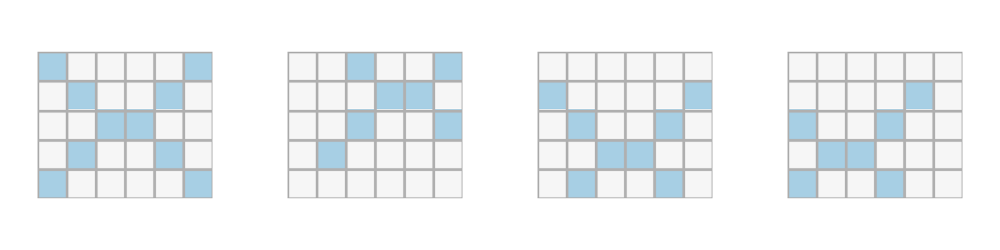 |
<details>

```bash
python src/make_xo_dataset.py \
    -o out/xo/demo_set/ \
    --x_path data/xo/inputs/x.txt \
    --o_path data/xo/inputs/o.txt \
    --n_per_class 4 \
    --max_shift 1 \
    --noise_p 0.0
for txt in $(cat out/xo/demo_set/train.tsv | grep -v "^#" | cut -f2); do
    dir=$(dirname $txt)
    base=$(basename $txt .txt)
    png="${path}/${base}.png"
    python src/make_img.py \
        -i $txt \
        -o $png \
        --height 1 \
        --width 1
done
os=$(ls out/xo/demo_set/o_*png)
magick $os +append  out/xo/demo_set/os.png
xs=$(ls out/xo/demo_set/x_*png)
magick $xs +append  out/xo/demo_set/xs.png
```
</details>

## Train
To train, we need to build a small neural network around our kernel. With that
there are a few new components. First, in addition to the values in the kernel,
we will also learn a single bias number that will be added to each element in
the feature map before pooling. And finally, we will use a function called
sigmoid to convert the pooled score into a probability. Since we want to find a
kernel that helps us tell if an image is an X or an O, the specific task we
will learn is the probability that the image is an X. A low score and low
probability suggests an O. A high score (and high probability) suggests an X.

We start with a kernel of random values. Then we run every image in our
training set through the network. For each image we get a pooled value (here
we're just doing max pooling) and with the sigmoid the probability the image is
an X. Ideally X's should be close to 1 and O's close to 0. The distance from
those ideal values is called the loss and it tells us how far off we are. Here
we use the binary cross-entropy loss, which penalizes confidently wrong results
(a probability near 0 for an X, or near 1 for an O) more than less confident
misses.

With the loss we then update the kernel values and the bias using gradient
descent. Gradient descent determines which direction to change the kernel
weights and bias to make the estimate a closer to correct, and then takes a
small step in that direction based on the learning rate. All of that is one epoch.
We repeat these steps and the kernel values gradually move toward values that
give probabilities that ideally separate X's from O's.

At each epoch we get a report of what was learned:
```
epoch 0001 loss=0.6858 acc=0.500  meanP(X)=0.631 meanP(O)=0.598
```
- `loss`: the binary cross-entropy loss
- `acc`: accuracy, the fraction of training images classified correctly
- `meanP(X)`: the average predicted probability of being an X for all X's
- `meanP(O)`: the average predicted probability of being an X for all O's

At epoch 1 the kernel and bias are random. These random numbers tend to
classify most images as an X. Both `meanP(X)` and `meanP(O)` are above 0.5,
it's guessing X for everything. Since half the images are Os, the accuracy is
0.5.

In the final epoch we get:
```
epoch 0200 loss=0.3497 acc=0.836  meanP(X)=0.748 meanP(O)=0.272
```
The loss is about half of what it was to start so the predictions are closer to
correct. The probabilities tend to be high for X inputs and low for O inputs.

By looking at how these values evolved we can learn important characteristics
of the model.

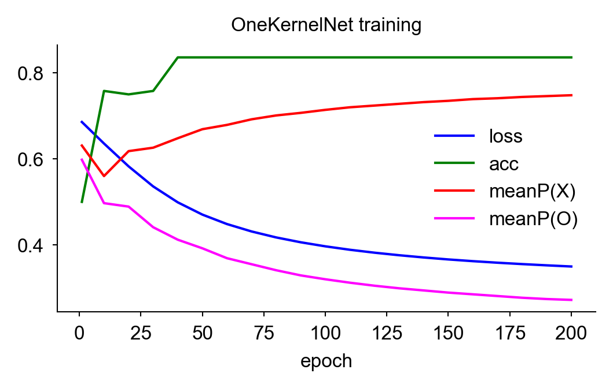

Here, accuracy is flat at 0.836 after about epoch 40 while the other values
continue to improve. That is, after epoch 40, the model does not fix any more
of its mistakes but gets more confident in the things it already gets correct.
No setting of the kernel and bias values will fix those remaining mistakes.
The model has reached the performance ceiling of a model with just a single
kernel and bias. To get better accuracy we would need a bigger model with more
parameters. Possible options are to use a bigger kernel or use  more kernels.

Flat accuracy and falling loss is also a signature of overfitting. The model
is getting more confident about the specific training examples it has
memorized, rather than learning anything more general. Since both explanations
produce the same training curve, we need a held-out evaluation to tell which
one is happening.

In the end we get:
| Kernel | Bias |
|-|-|
|  | -4.335400581359863 |
<details>

```bash
python src/make_xo_dataset.py \
    -o out/xo/training_set \
    --x_path data/xo/inputs/x.txt \
    --o_path data/xo/inputs/o.txt \
    --n_per_class 64 
python src/train_xo_kernel.py \
  --train out/xo/training_set/train.tsv \
  --out_prefix out/xo/xo_learned \
  --kernel 3 \
  --pool max \
  --epochs 200 \
  --lr 0.1
epoch 0001 loss=0.6858 acc=0.500  meanP(X)=0.631 meanP(O)=0.598
epoch 0010 loss=0.6357 acc=0.758  meanP(X)=0.560 meanP(O)=0.497
epoch 0020 loss=0.5826 acc=0.750  meanP(X)=0.618 meanP(O)=0.489
epoch 0030 loss=0.5359 acc=0.758  meanP(X)=0.626 meanP(O)=0.441
epoch 0040 loss=0.4989 acc=0.836  meanP(X)=0.648 meanP(O)=0.412
epoch 0050 loss=0.4704 acc=0.836  meanP(X)=0.669 meanP(O)=0.392
epoch 0060 loss=0.4484 acc=0.836  meanP(X)=0.679 meanP(O)=0.369
epoch 0070 loss=0.4312 acc=0.836  meanP(X)=0.692 meanP(O)=0.355
epoch 0080 loss=0.4173 acc=0.836  meanP(X)=0.701 meanP(O)=0.341
epoch 0090 loss=0.4060 acc=0.836  meanP(X)=0.707 meanP(O)=0.329
epoch 0100 loss=0.3966 acc=0.836  meanP(X)=0.714 meanP(O)=0.320
epoch 0110 loss=0.3886 acc=0.836  meanP(X)=0.720 meanP(O)=0.312
epoch 0120 loss=0.3818 acc=0.836  meanP(X)=0.724 meanP(O)=0.305
epoch 0130 loss=0.3759 acc=0.836  meanP(X)=0.728 meanP(O)=0.299
epoch 0140 loss=0.3707 acc=0.836  meanP(X)=0.732 meanP(O)=0.294
epoch 0150 loss=0.3661 acc=0.836  meanP(X)=0.735 meanP(O)=0.289
epoch 0160 loss=0.3621 acc=0.836  meanP(X)=0.739 meanP(O)=0.285
epoch 0170 loss=0.3585 acc=0.836  meanP(X)=0.741 meanP(O)=0.281
epoch 0180 loss=0.3553 acc=0.836  meanP(X)=0.744 meanP(O)=0.277
epoch 0190 loss=0.3524 acc=0.836  meanP(X)=0.746 meanP(O)=0.274
epoch 0200 loss=0.3497 acc=0.836  meanP(X)=0.748 meanP(O)=0.272
learned bias: -4.335400581359863
python src/plot_training_log.py \
  -i out/xo/xo_learned.kernel.log \
  -o img/xo/xo_learned_training.png \
  --title "OneKernelNet training"
```
</details>

## Test
Now we can take a few images that were not part of the training set to
see how well it works.
| Input | Max score + bias | P(X) |
| - | - | - |
| 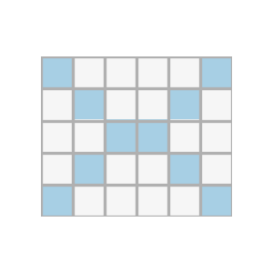 | 2.50 | 0.92 |
| 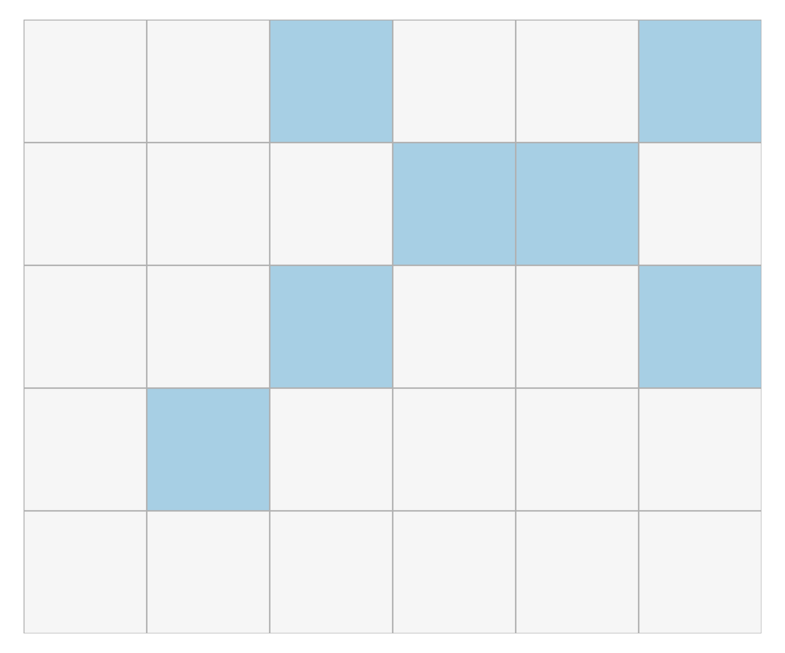 | 2.50 | 0.92 |
| 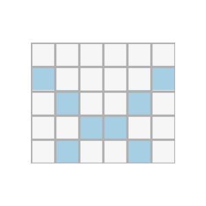 | 2.50 | 0.92 |
|  | 0.39 | 0.59 |
|  | -2.77 | 0.05 |
| 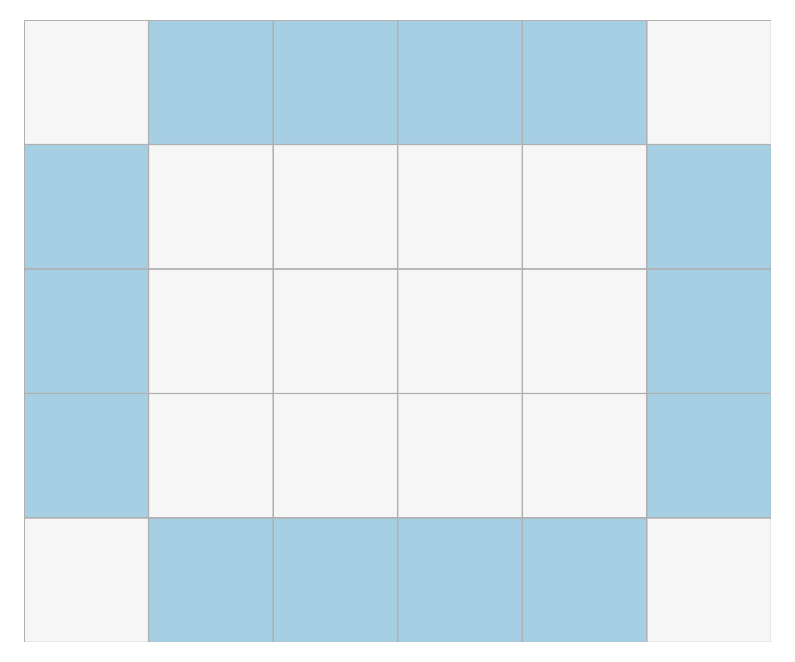 | -0.49 | 0.37 |
| 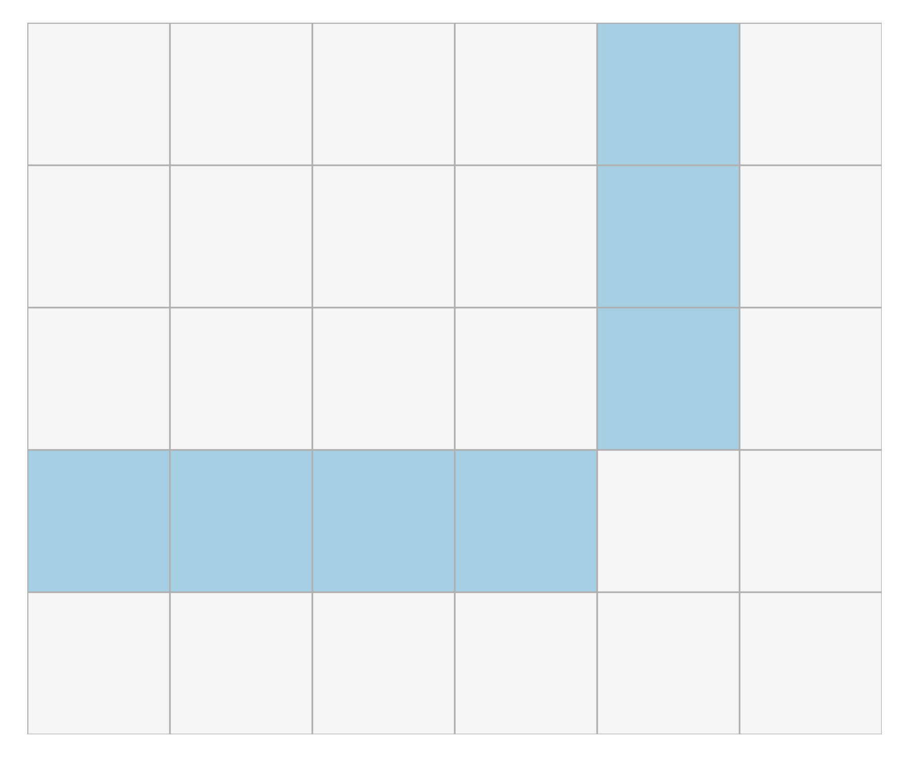 | -2.30 | 0.09 |
| 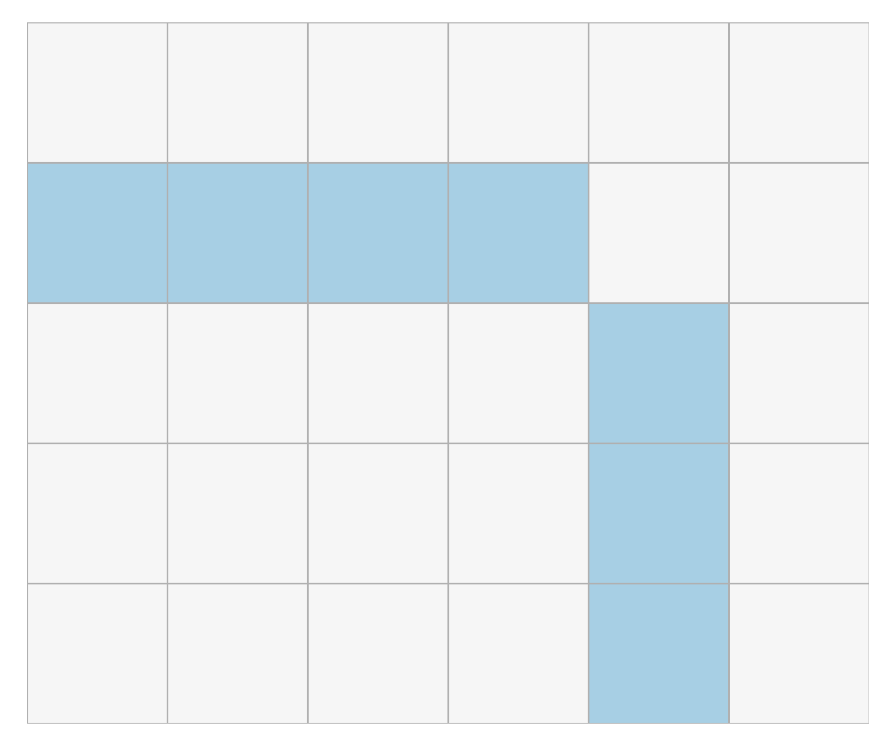 | -2.30 | 0.09 |
<details>

```bash
for txt in $(cat out/xo/demo_set/train.tsv | grep -v "^#" | cut -f2); do
    echo $txt
    python src/img_conv.py \
        -i $txt \
        -k out/xo/xo_learned.kernel.txt \
        -b -4.335400581359863 \
        -o /dev/null
done
```
</details>

## Bigger 4x4 Kernel


| Kernel | Training Curve |
|-|-|
|  | 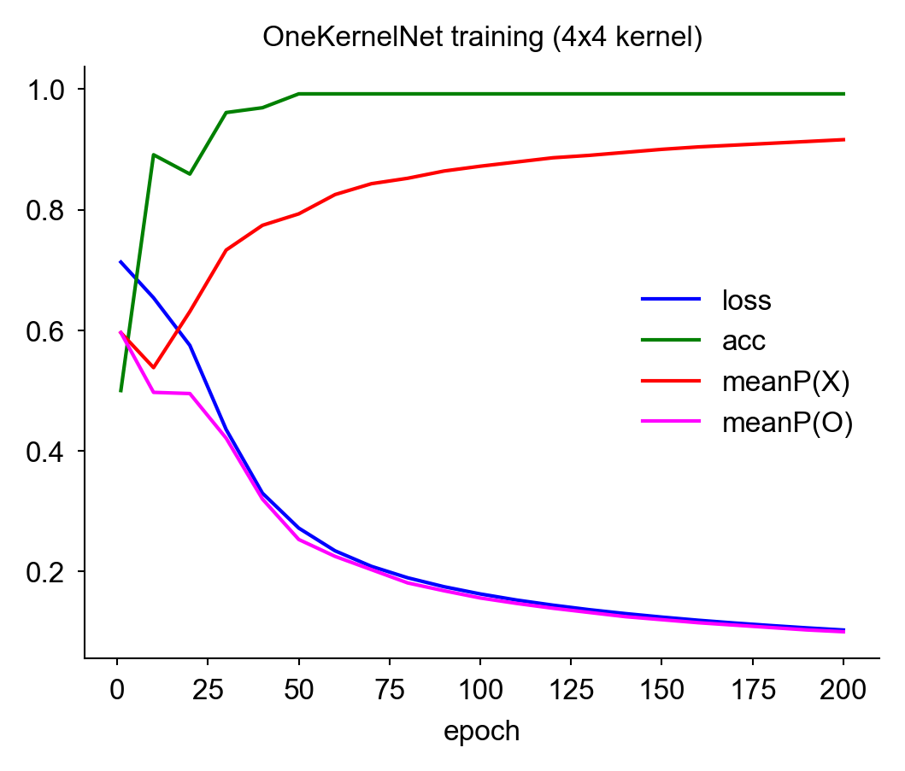 |

Going from a 3x3 to a 4x4 kernel moves the model from 10 to 17 parameters,
improved the performance ceiling, but still had overfitting issues. Accuracy
was 0.992 by epoch 50, which corsponds to the model is only misclassifying 1
out of the training images. Some one the ones it had trouble with include:


| Label | Input | P(X) |
|-|-|-|
| X |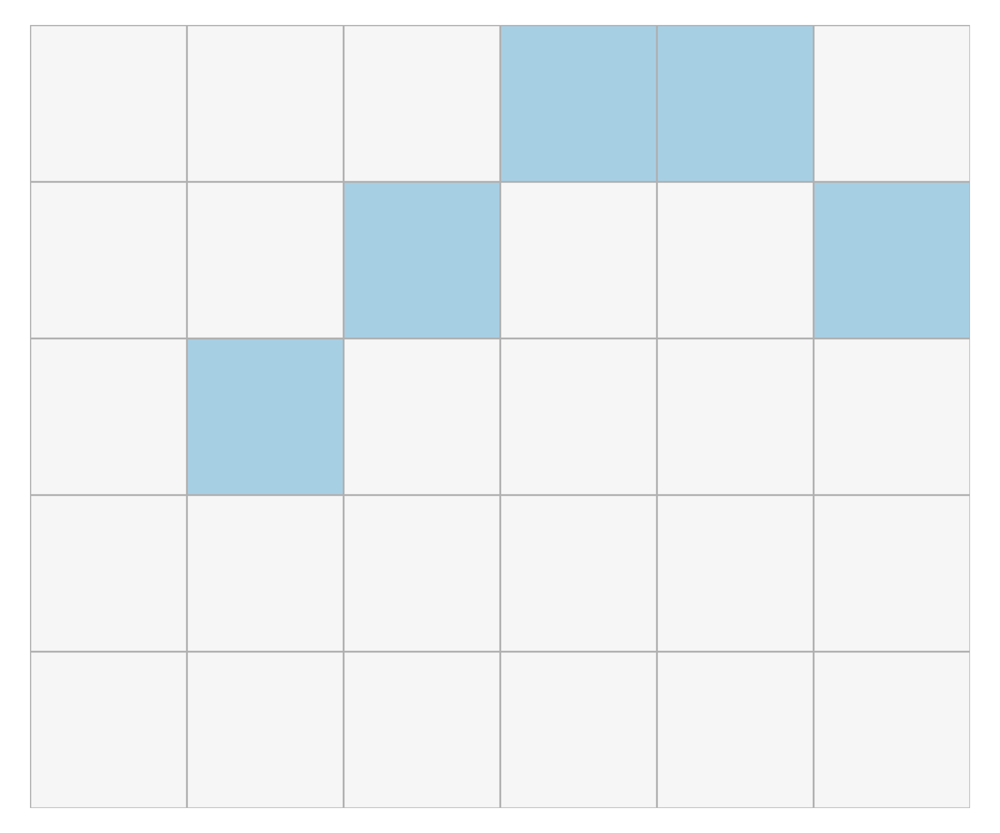 | 0.074 |
| X |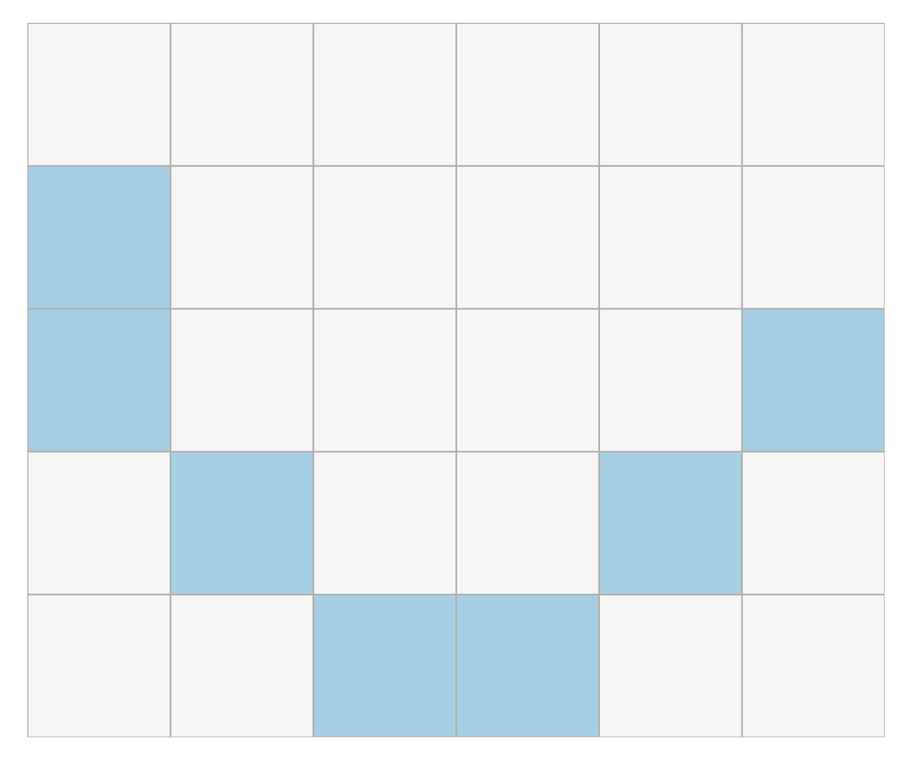 | 0.2 |
| X |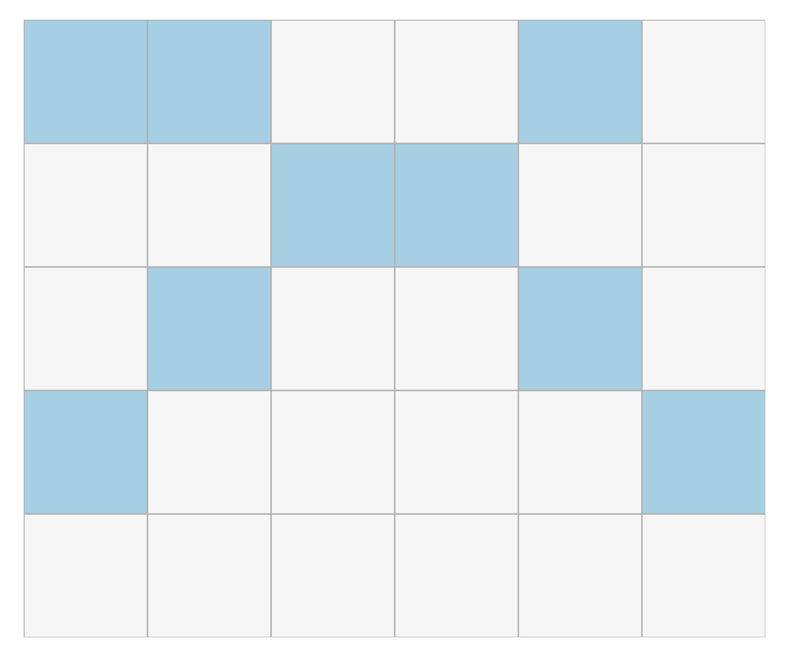 | 0.1 |


The shape of the curves is similar, meaning the model has run out of
correctable mistakes and spends most training improving its confidence.  While
extra capacity lets the kernel fit noise as well as signal, it may now be large
enough to partially memorize the specific 128 training augmentations, rather
than learning the pattern better. The held-out evaluation will help determine
if the model is overfitting.

<details>

```
python src/train_xo_kernel.py \
  --train out/xo/training_set/train.tsv \
  --out_prefix out/xo/xo_learned.4k \
  --kernel 4 \
  --pool max \
  --epochs 200 \
  --lr 0.1
epoch 0001 loss=0.7130 acc=0.500  meanP(X)=0.596 meanP(O)=0.596
epoch 0010 loss=0.6538 acc=0.891  meanP(X)=0.538 meanP(O)=0.497
epoch 0020 loss=0.5749 acc=0.859  meanP(X)=0.631 meanP(O)=0.495
epoch 0030 loss=0.4354 acc=0.961  meanP(X)=0.733 meanP(O)=0.421
epoch 0040 loss=0.3298 acc=0.969  meanP(X)=0.774 meanP(O)=0.320
epoch 0050 loss=0.2719 acc=0.992  meanP(X)=0.793 meanP(O)=0.253
epoch 0060 loss=0.2342 acc=0.992  meanP(X)=0.825 meanP(O)=0.225
epoch 0070 loss=0.2085 acc=0.992  meanP(X)=0.843 meanP(O)=0.203
epoch 0080 loss=0.1895 acc=0.992  meanP(X)=0.852 meanP(O)=0.181
epoch 0090 loss=0.1747 acc=0.992  meanP(X)=0.864 meanP(O)=0.168
epoch 0100 loss=0.1627 acc=0.992  meanP(X)=0.872 meanP(O)=0.156
epoch 0110 loss=0.1526 acc=0.992  meanP(X)=0.879 meanP(O)=0.147
epoch 0120 loss=0.1441 acc=0.992  meanP(X)=0.886 meanP(O)=0.139
epoch 0130 loss=0.1366 acc=0.992  meanP(X)=0.890 meanP(O)=0.132
epoch 0140 loss=0.1301 acc=0.992  meanP(X)=0.895 meanP(O)=0.125
epoch 0150 loss=0.1243 acc=0.992  meanP(X)=0.900 meanP(O)=0.120
epoch 0160 loss=0.1191 acc=0.992  meanP(X)=0.904 meanP(O)=0.115
epoch 0170 loss=0.1145 acc=0.992  meanP(X)=0.907 meanP(O)=0.111
epoch 0180 loss=0.1103 acc=0.992  meanP(X)=0.910 meanP(O)=0.107
epoch 0190 loss=0.1064 acc=0.992  meanP(X)=0.913 meanP(O)=0.103
epoch 0200 loss=0.1029 acc=0.992  meanP(X)=0.916 meanP(O)=0.100
learned bias: -4.417042255401611
python src/plot_training_log.py \
  -i out/xo/xo_learned.kernel.4k.log \
  -o img/xo/xo_learned_training.4k.png \
  --title "OneKernelNet training (4x4 kernel)"

for i in $(ls out/xo/training_set/*txt); do
    echo $i
    python src/img_conv.py \
        -i $i \
        -k out/xo/xo_learned.4k.kernel.txt \
        -o /dev/null \
        -b -4.417042255401611
done
```

</details>

## More Kernels

