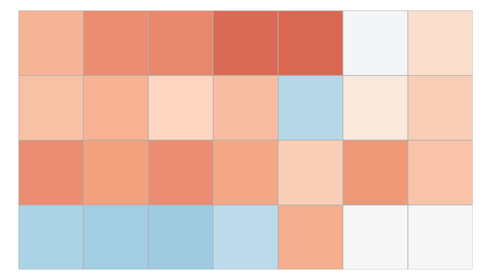
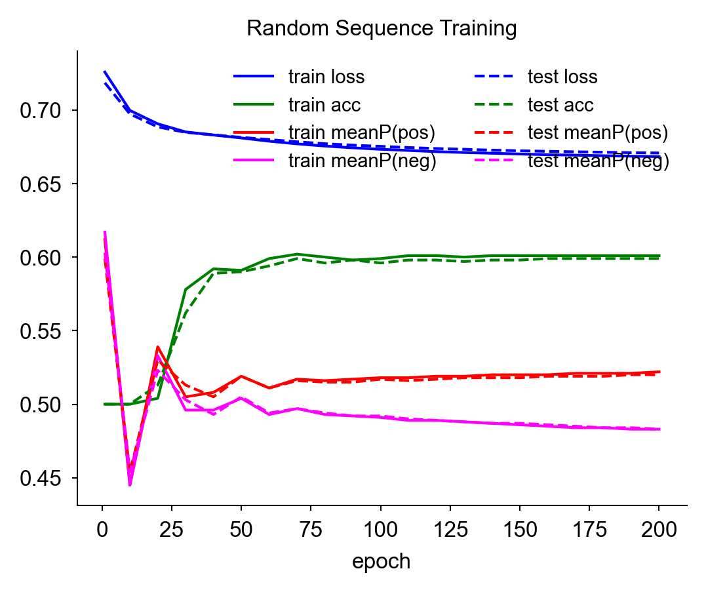
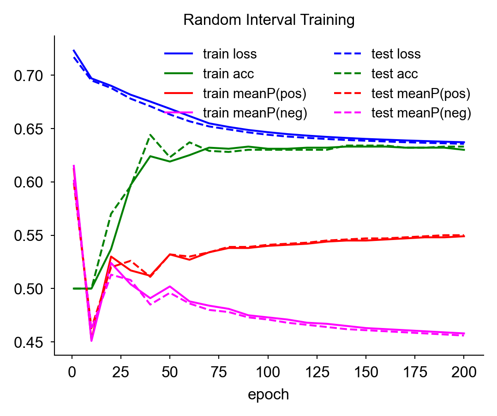
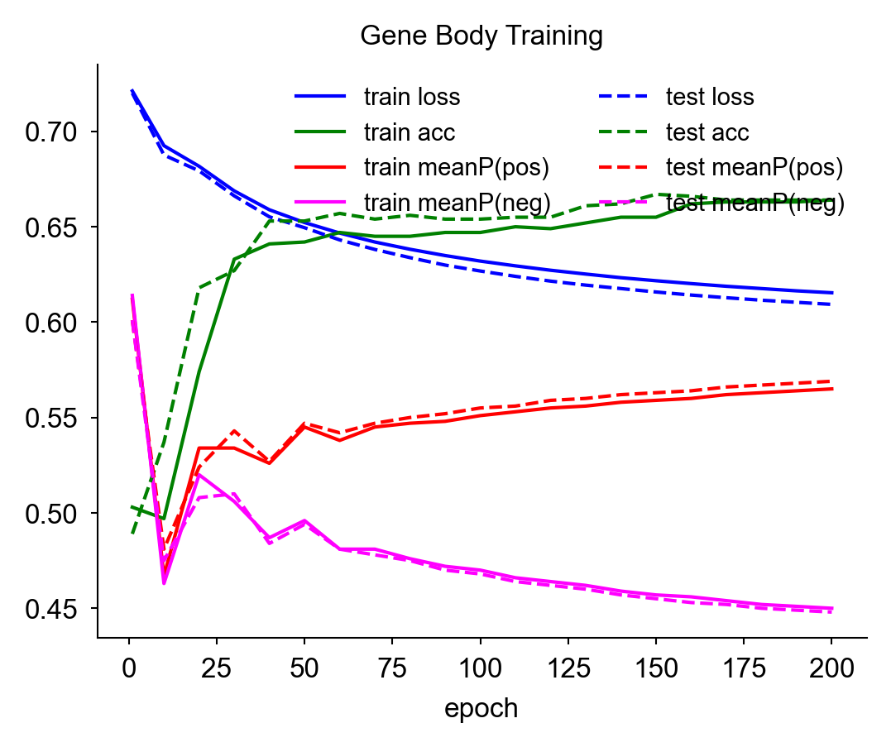

# DNA Sequence Convolution
## Data representation
### DNA Sequence One-hot Encoding
A DNA sequence is a string of nucleotide bases represented by the letters A, C,
G, and T, but convolution requires numerical input. In machine learning,
one-hot encoding is the standard method for dealing with categorical data,
where:
- the input is represented by a bit string
- the bit string length equals the number of categories
- each bit corresponds to one category
- the set bit identifies the selected category
- only one bit can be set

For a DNA sequence, the one-hot encoding is:

| Base | One-hot vector |
|-|-|
| `A` | `1 0 0 0` |
| `C` | `0 1 0 0` |
| `G` | `0 0 1 0` |
| `T` | `0 0 0 1` |

With this one-hot encoding, a DNA sequence of length L becomes a 4×L matrix:

| Sequence | One-hot representation |
|-|-|
| `GCATATAAATCG` | `0 0 1 0 1 0 1 1 1 0 0 0` <br> `0 1 0 0 0 0 0 0 0 0 1 0` <br> `1 0 0 0 0 0 0 0 0 0 0 1` <br> `0 0 0 1 0 1 0 0 0 1 0 0` |

### TATA box kernel
The TATA box is a sequence found in the promoter region of many eukaryotic genes.
The classical consensus sequence is `TATA(A/T)A(A/T)`, which can be represented
by the following kernel:
```
0 1 0 1 1 1 1
0 0 0 0 0 0 0
0 0 0 0 0 0 0
1 0 1 0 1 0 1
```

Note that this kernel is not a one-hot encoding. The variable base positions at
5 and 7, which can be either A or T, have both of those bits set in the kernel.
While our inputs will be one-hot encodings, the kernel is a set of weights and
is not required to be a one-hot encoding.

| Label | Sequence | Feature Map | Max Pooling | Mean Pooling | P(TATA) max | P(TATA) mean |
|-|-|-|-|-|-|-|
| TATA box    | `GCTATAAATCG` | `5  3  7  2  4` | 7 | 4.2 | 0.999 | 0.985 |
| TATA box    | `ACTATATAATG` | `5  2  7  3  5` | 7 | 4.4 | 0.999 | 0.988 |
| No TATA box | `CGGCATCGGAC` | `1  2  0  3  1` | 3 | 1.4 | 0.953 | 0.802 |
| No TATA box | `ATCGGCTAGCA` | `1  2  2  1  3` | 3 | 1.8 | 0.953 | 0.858 |

<details>

```
python src/dna_conv.py \
    -i data/dna/tata_ex/inputs/tata_box_0.txt \
    -k data/dna/tata_ex/kernels/kernel_tata_box.txt 
Scores:
    Max pooling : 7.000000
    Mean pooling : 4.200000
After sigmoid (probability of motif):
    Max pooling : 0.999089
    Mean pooling : 0.985226

python src/dna_conv.py
    -i data/dna/tata_ex/inputs/tata_box_1.txt \
    -k data/dna/tata_ex/kernels/kernel_tata_box.txt 
Scores:
    Max pooling : 7.000000
    Mean pooling : 4.400000
After sigmoid (probability of motif):
    Max pooling : 0.999089
    Mean pooling : 0.987872

python src/dna_conv.py \
    -i data/dna/tata_ex/inputs/no_tata_box_0.txt \
    -k data/dna/tata_ex/kernels/kernel_tata_box.txt
Scores:
    Max pooling : 3.000000
    Mean pooling : 1.400000
After sigmoid (probability of motif):
    Max pooling : 0.952574
    Mean pooling : 0.802184

python src/dna_conv.py \
    -i data/dna/tata_ex/inputs/no_tata_box_1.txt \
    -k data/dna/tata_ex/kernels/kernel_tata_box.txt 
Scores:
    Max pooling : 3.000000
    Mean pooling : 1.800000
After sigmoid (probability of motif):
    Max pooling : 0.952574
    Mean pooling : 0.858149
```
</details>

This TATA kernel successfully differentiated between sequences that contain a
TATA box and those that don't, correctly matching two different valid instances
of the degenerate consensus.  Max pooling asks whether the motif appears
anywhere in the sequence, and the TATA-box sequences had max pool scores of 7,
while neither non-TATA sequence had a max score over 3. Mean pooling asks how
motif-like the sequence is on average. This also separated the two, with scores
around 4 and 2.

The differentiation is less clear among the post-sigmoid probabilities, but
this is expected with uncalibrated scores. In training, the model will learn a
bias that recenters the sigmoid so match and non-match cases separate more
clearly.

## Training

### Generate training set

There is a lot of genomic data, so there is no need here for data augmentation.
We just need to pick positive and negative examples. Since TATA boxes are in
the gene promoter region, we can use regions that are upstream of a gene as
positives. To get these sequences, we need a reference genome and a set of gene
annotations. NCBI has thousands of these. Here we will use yeast since it is
small (12 Mb), well characterized, and there are many strains to choose from.
For training we will use the most common lab species, Saccharomyces cerevisiae.
Yeast promoter biology is also some of the best studied, so we can compare our
results to the literature. For example, only about 20% of the yeast genes have
a TATA box, while the rest use other structures ([Basehoar et
al.](https://linkinghub.elsevier.com/retrieve/pii/S0092867404002053)).

These promoter sequences will constitute our positive set. Training requires a
negative set, which ideally would be sequences that do not contain TATA boxes.
While there are many options for a negative set, care must be taken because the
structure of the negative set will determine what the model learns. To ensure
that it learns promoter-specific sequences, the negative set should closely
match the structure of the positive set. As we will see, deviations from this
matched structure result in the model learning some shortcut.


- Get the reference sequences and gene annotations from NCBI

  <details>
  - https://www.ncbi.nlm.nih.gov/datasets/genome/GCF_000146045.2/
  - Get the RefSeq FASTA and GFF
  - move `ncbi_dataset.zip` into `data/dna/yeast/` and unzip
  </details>

- Get positive set
  - Upstream-of-TSS regions
    - We get the strand and position of the genes in the GFF, then grab the up
      and downstream of the gene as defined by the `--upstream` and
      `--downstream` parameters. Strand determines if this window is just
      before or just after the gene in the linear reference. We take the
      reverse complement for negative strand genes.
    - Since the GFF often gives the gene boundaries as the ORF, from start
      codon to in-frame stop codon, and not the experimentally derived TSS,
      we have to make the upstream component long enough to account for the
      UTR (which is typically about 50bp,
      [Nagalakshmi et al.](https://pmc.ncbi.nlm.nih.gov/articles/PMC2951732/))
      and the TATA box.
    <details>

    ```
    dir="data/dna/yeast/ncbi_dataset/data/GCF_000146045.2"
    python src/extract_upstream_tss.py \
      -f $dir/GCF_000146045.2_R64_genomic.fna \
      -g $dir/genomic.gff \
      -o data/dna/yeast/training/tss/upstream \
      --upstream 150 \
      --downstream 50
    genes in GFF (after biotype filter): 6021
      written             : 6020
      dropped (bad chrom) : 0
      dropped (edge/OOB)  : 1
    manifest: data/dna/yeast/training/tss/upstream/coords.tsv
    ```

    </details>

- Get negative sets
  - Random sequence
    - Generate random sequences Using the nucleotide frequency distribution
      derived from the reference. 
    - Sine the genome is not random, we expect the model to quickly
      differentiage betweeen random and not, without leanring anything about
      TATA boxes. Yeast promoters are more AT-rich than the rest of the genome,
      so it is possible that the model learns to just predict that property.
    - We can test this with test seuences that are AT-rich with a TATA box,
      AT-rich without one, GC-balanced with a TATA box, and GC-balanced without
      one.
    <details>

    ```
    dir="data/dna/yeast/ncbi_dataset/data/GCF_000146045.2"
    python src/make_negatives_random_sequence.py \
        -f $dir/GCF_000146045.2_R64_genomic.fna \
        -m data/dna/yeast/training/tss/upstream/coords.tsv \
        -o data/dna/yeast/training/tss/negatives/random_sequence \
        --seed 0
    base probabilities (from genome): A=0.310, C=0.191, G=0.191, T=0.309
    wrote 6020 random_sequence negatives (length 200) -> data/dna/yeast/training/tss/negatives/random_sequence
    ```

    </details>
  - Random intervals
    - Sample real genomic windows, weighted by chromosome length, excluding any
      window that overlaps a TSS window.
    - Since our annotation only marks gene and ORF boundaries, not real TSS or
      TATA box locations, some random intervals could overlap an unannotated
      promoter and contain a TATA box.
    - The random intervals will be a mix of coding and non-coding sequence, and
      the model could learn to separate coding from noncoding rather than TATA
      from not. Yeast has far more coding sequence than human, so the effect
      may be lower.
    - We can test this by comparing performance on held-out coding and
      noncoding sequences to see if the kernel differentiates the two.
    <details>
    ```
    dir="data/dna/yeast/ncbi_dataset/data/GCF_000146045.2"
    python src/make_negatives_random_interval.py \
        -f $dir/GCF_000146045.2_R64_genomic.fna \
        -m data/dna/yeast/training/tss/upstream/coords.tsv \
        -o data/dna/yeast/training/tss/negatives/random_interval \
        --seed 0
    wrote 6020 random_interval negatives (length 200) -> data/dna/yeast/training/tss/negatives/random_interval
    ```

    </details>
  - Gene body
    - Sample from inside the same annotated genes as the positives, offset past
      a buffer downstream of the TSS so they don't overlap a true positive
      window.
    - Since these come from the same genes, they should share similar sequence
      and structural properties.
    - The primary issue is leakage. In this setup, each gene provides negative
      and positive sequences. Abstractly, our training has two training
      elements that are subsequences of the same larger sequence, which are
      likely to have similar sequence and structure. If the train/test split
      puts one of a gene's sequences in training and the other in test, the
      model could effectively be tested on a gene it already saw during
      training. Correct classification in that case might reflect memorizing
      that gene's sequence, not a decision based on the presence or absence of
      a promoter. The solution is to split train and test by gene rather than
      by individual sequence, assigning each gene to either the train or the
      test set before any sequences are extracted, so all of a gene's positive
      and negative windows end up on either train or test and not both.
    <details>

    ```
    dir="data/dna/yeast/ncbi_dataset/data/GCF_000146045.2"
    python src/make_negatives_gene_body.py \
        -f $dir/GCF_000146045.2_R64_genomic.fna \
        -g $dir/genomic.gff \
        -m data/dna/yeast/training/tss/upstream/coords.tsv \
        -o data/dna/yeast/training/tss/negatives/gene_body \
        --seed 0
    window length: 200, buffer: 200 bp past TSS, candidate genes: 6021
    wrote 6020 gene_body negatives (length 200) -> data/dna/yeast/training/tss/negatives/gene_body
    ```

    </details>
### Train

- Random sequence

  |  Kernel | Training plot |
  |-|-|
  |  |  |

  <details>

  ``` 
  python src/build_train_test_split.py \
      -p data/dna/yeast/training/tss/upstream/coords.tsv \
      -n data/dna/yeast/training/tss/negatives/random_sequence/coords.tsv \
      -o data/dna/yeast/training/splits/random_sequence \
      --test_frac 0.2 \
      --seed 0
  genes total: 6020  (test genes: 1204)
  train: 4816 positive, 4816 negative -> data/dna/yeast/training/splits/random_sequence/train.tsv
  test:  1204 positive, 1204 negative -> data/dna/yeast/training/splits/random_sequence/test.tsv
  python src/train_tata_kernel.py \
      --train data/dna/yeast/training/splits/random_sequence/train.tsv \
      --test data/dna/yeast/training/splits/random_sequence/test.tsv \
      --kernel 7 --pool max --epochs 200 --lr 0.1 --seed 0 \
      --out_prefix out/dna/random_sequence/random_sequence \
  > out/dna/random_sequence/random_sequence.kernel.log

  python src/plot_tata_training_log.py \
    -i out/dna/random_sequence/random_sequence.kernel.log \
    -o out/dna/random_sequence/random_sequence.kernel.log.png \
    --title "Random Sequence Training"

  python src/make_img.py \
    -i out/dna/random_sequence/random_sequence.kernel.txt \
    -o out/dna/random_sequence/random_sequence.kernel.png \
    --vmin -1.03307 \
    --vmax 1.03307

  ``` 

  </details>

- Random intervals

  |  Kernel | Training plot |
  |-|-|
  |  |  |

  <details>

  ```
  python src/build_train_test_split.py \
      -p data/dna/yeast/training/tss/upstream/coords.tsv \
      -n data/dna/yeast/training/tss/negatives/random_interval/coords.tsv \
      -o data/dna/yeast/training/splits/random_interval \
      --test_frac 0.2 \
      --seed 0
  genes total: 6020  (test genes: 1204)
  train: 4816 positive, 4816 negative -> data/dna/yeast/training/splits/random_interval/train.tsv
  test:  1204 positive, 1204 negative -> data/dna/yeast/training/splits/random_interval/test.tsv

  python src/train_tata_kernel.py \
      --train data/dna/yeast/training/splits/random_interval/train.tsv \
      --test data/dna/yeast/training/splits/random_interval/test.tsv \
      --kernel 7 --pool max --epochs 200 --lr 0.1 --seed 0 \
      --out_prefix out/dna/random_interval/random_interval \
  > out/dna/random_interval/random_interval.kernel.log

  python src/plot_tata_training_log.py \
    -i out/dna/random_interval/random_interval.kernel.log \
    -o out/dna/random_interval/random_interval.kernel.log.png \
    --title "Random Interval Training"

  python src/make_img.py \
    -i out/dna/random_interval/random_interval.kernel.txt \
    -o out/dna/random_interval/random_interval.kernel.png \
    --vmin -1.03307 \
    --vmax 1.03307
  ```

  </details>

- Gene body

  |  Kernel | Training plot |
  |-|-|
  |  |  |
  <details>

  ```
  python src/build_train_test_split.py \
      -p data/dna/yeast/training/tss/upstream/coords.tsv \
      -n data/dna/yeast/training/tss/negatives/gene_body/coords.tsv \
      -o data/dna/yeast/training/splits/gene_body \
      --test_frac 0.2 \
      --seed 0
  genes total: 6021  (test genes: 1204)
  train: 4816 positive, 4760 negative -> data/dna/yeast/training/splits/gene_body/train.tsv
  test:  1204 positive, 1260 negative -> data/dna/yeast/training/splits/gene_body/test.tsv

  python src/train_tata_kernel.py \
      --train data/dna/yeast/training/splits/gene_body/train.tsv \
      --test data/dna/yeast/training/splits/gene_body/test.tsv \
      --kernel 7 --pool max --epochs 200 --lr 0.1 --seed 0 \
      --out_prefix out/dna/gene_body/gene_body \
  > out/dna/gene_body/gene_body.kernel.log

  python src/plot_tata_training_log.py \
    -i out/dna/gene_body/gene_body.kernel.log \
    -o out/dna/gene_body/gene_body.kernel.log.png \
    --title "Gene Body Training"

  python src/make_img.py \
    -i out/dna/gene_body/gene_body.kernel.txt \
    -o out/dna/gene_body/gene_body.kernel.png \
    --vmin -1.03307 \
    --vmax 1.03307
  ``` 

  </details>
